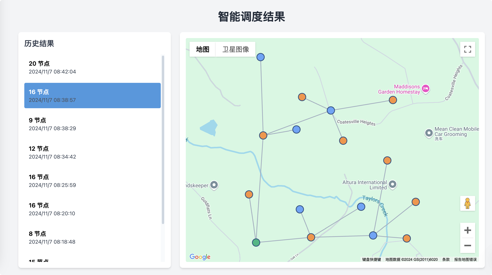

# SkyNet 智能调度模块

## 项目简介

用于生成和优化 WiFi Mesh 网络拓扑的服务。该服务接收节点信息(包括 GPS 坐标、负载、可用信道等)和边信息(RSSI值)，通过改进的 Prim 算法生成最优的网络拓扑结构，并进行信道分配。

## 主要功能

- 基于多维约束的拓扑生成
- 自适应的信道分配
- REST API 接口
- 完整的日志记录
- Docker 容器化部署

## 可视化界面

系统提供了基于 Web 的可视化界面，用于直观展示网络拓扑结构。

### 主要功能

- 基于 Google Maps 的节点位置展示
- 节点间连接关系可视化
- 历史拓扑结果浏览
- 节点详细信息查看

### 界面预览



### 节点图例

- 🟢 根节点(Root Node)
- 🟠 高频回程节点(High Band Backhaul)
- 🔵 低频回程节点(Low Band Backhaul)

### 使用说明

1. 访问可视化界面:
```bash
http://localhost:8080
```

2. 左侧面板显示历史拓扑生成结果列表
3. 点击列表项可在地图上查看对应的拓扑结构
4. 点击节点可查看详细信息

## 系统架构

系统主要由以下模块组成：

- `TopologyGenerator`: 核心拓扑生成模块
- `ChannelAssigner`: 信道分配模块
- `API`: RESTful 接口层
- `Validators`: 输入数据验证模块

## API 接口

### 生成拓扑

```
POST /generate_topology
```

请求体示例:
```json
{
  "nodes_json": "...",
  "edges_json": "...",
  "config_json": "..." // 可选
}
```

响应示例:
```json
{
  "status": "success",
  "data": {
    "SN0": {
      "parent": null,
      "backhaulBand": null,
      "level": 0,
      "channel": [143, 47],
      "bandwidth": [160, 160],
      "maxEirp": [36, 36]
    },
    ...
  }
}
```

## 配置参数

主要配置参数在 `TopologyConfig` 类中定义：


```1:11:src/config.py
from dataclasses import dataclass

@dataclass
class TopologyConfig:
    MAX_DEGREE: int = 3
    RSSI_THRESHOLD: int = -72
    MAX_HOP: int = 5
    THROUGHPUT_WEIGHT: float = 1.0
    LOAD_WEIGHT: float = 0.5
    HOP_WEIGHT: float = -80.0
    RSSI_CONFLICT_THRESHOLD: int = -85
```


## 部署说明

### 环境要求

- Python 3.9+
- Docker
- Docker Compose

### Docker 部署

1. 构建镜像并启动容器:
```bash
docker-compose up -d
```

2. 检查服务状态:
```bash
curl http://localhost:8080/health
```

### 日志

- 日志文件路径: `/var/log/topo-planner/topo-planner.log`
- 日志级别: DEBUG(文件), INFO(控制台)

## 测试

项目包含完整的单元测试套件，使用 JUnit 5 框架。测试用例位于:


```21:71:src/test/java/com/example/mesh/TopologyTest.java
    @Test
    public void testTopologyGeneration() throws Exception {
        // 生成测试数据
        TestData testData = generateTestData();
        
        // 在转换为JSON之前打印测试数据
        System.out.println("Test data before serialization:");
        System.out.println("Nodes: " + mapper.writeValueAsString(testData.nodes));
        System.out.println("Edges: " + mapper.writeValueAsString(testData.edges));
        
        // 转换为JSON
        String requestBody = mapper.writeValueAsString(Map.of(
            "nodes_json", mapper.writeValueAsString(testData.nodes),
            "edges_json", mapper.writeValueAsString(testData.edges)
        ));

        // 创建HTTP请求
        HttpRequest request = HttpRequest.newBuilder()
            .uri(URI.create(API_URL))
            .header("Content-Type", "application/json")
            .header("Accept", "application/json")
            .POST(HttpRequest.BodyPublishers.ofString(requestBody))
            .build();

        // 创建一个新的 HttpClient
        HttpClient client = HttpClient.newBuilder()
            .version(HttpClient.Version.HTTP_1_1)
            .build();

        // 发送请求
        HttpResponse<String> response = client.send(request, 
            HttpResponse.BodyHandlers.ofString());

        // 打印格式化的请求和响应信息
        System.out.println("Request body:");
        System.out.println(prettyPrintJson(requestBody));
        System.out.println("\nResponse status: " + response.statusCode());
        System.out.println("Response body:");
        System.out.println(prettyPrintJson(response.body()));

        // 验证响应
        assertEquals(200, response.statusCode(), 
            "Expected status code 200 but got " + response.statusCode() + 
            ". Response body: " + response.body());

        // 验证响应格式
        var responseJson = mapper.readTree(response.body());
        assertTrue(responseJson.has("status"), "Response should have 'status' field");
        assertTrue(responseJson.has("data"), "Response should have 'data' field");
        assertEquals("success", responseJson.get("status").asText(), "Status should be 'success'");
    }
```


运行测试:
```bash
mvn test
```

## 错误处理

系统定义了多个自定义异常类来处理不同类型的错误：


```1:81:src/exceptions.py
class MeshTopologyError(Exception):
    """网状拓扑相关错误的基类"""
    def __init__(self, message: str, details: dict = None):
        self.message = message
        self.details = details or {}
        super().__init__(self.message)

    def __str__(self):
        if self.details:
            return f"{self.message} - 详细信息: {self.details}"
        return self.message

class InvalidInputError(MeshTopologyError):
    """输入数据无效的错误
    
    Attributes:
        field: 出错的字段名
        value: 导致错误的值
        requirement: 期望的要求
    """
    def __init__(self, message: str, field: str = None, value: any = None, requirement: str = None):
        details = {
            'field': field,
            'value': value,
            'requirement': requirement
        }
        super().__init__(message, details)

class TopologyGenerationError(MeshTopologyError):
    """拓扑生成过程中的错误
    
    Attributes:
        phase: 出错的阶段
        node_id: 相关的节点ID
        current_state: 出错时的状态信息
    """
    def __init__(self, message: str, phase: str = None, node_id: str = None, current_state: dict = None):
        details = {
            'phase': phase,
            'node_id': node_id,
            'current_state': current_state
        }
        super().__init__(message, details)
class ChannelAssignmentError(MeshTopologyError):
    """信道分配过程中的错误
    
    Attributes:
        node_id: 出错的节点ID
        band: 相关的频段
        attempted_channels: 尝试过的信道
        conflict_nodes: 冲突的节点列表
    """
    def __init__(self, message: str, node_id: str = None, band: str = None, 
                 attempted_channels: list = None, conflict_nodes: list = None):
        details = {
            'node_id': node_id,
            'band': band,
            'attempted_channels': attempted_channels,
            'conflict_nodes': conflict_nodes
        }
        super().__init__(message, details)

class ValidationError(MeshTopologyError):
    """数据验证错误
    
    Attributes:
        field: 验证失败的字段
        value: 无效的值
        constraints: 验证约束条件
        context: 额外的上下文信息
    """
    def __init__(self, message: str, field: str = None, value: any = None, 
                 constraints: dict = None, context: dict = None):
        details = {
            'field': field,
            'value': value,
            'constraints': constraints,
            'context': context
        }
        super().__init__(message, details)
```


## 依赖

主要 Python 依赖:
- FastAPI
- Uvicorn
- Pydantic

详细依赖列表见 `requirements.txt`。